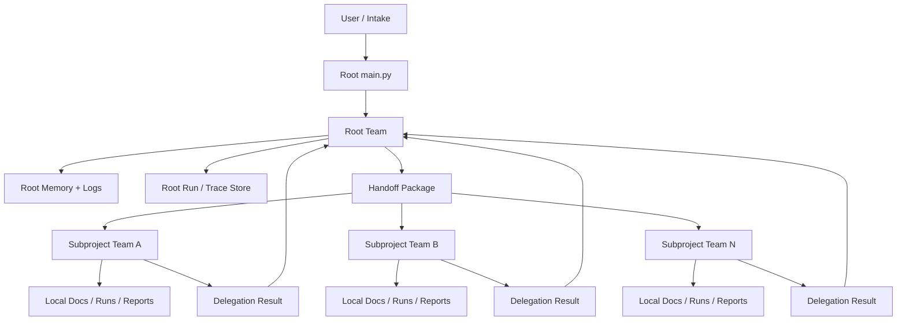

# Team Topology and Runtime Protocols

## Goal

Зафиксировать рекомендуемую структуру:

- root multi-agent team;
- local subproject multi-agent teams;
- контракты обмена между ними;
- границы ответственности и прав записи.

## Scope note

Этот документ теперь следует читать как **компактную protocol summary**.

Подробная scaled-up organizational model с департаментами, heads, staff agents и shared service agents вынесена в:

- `HIERARCHICAL_DEPARTMENT_MODEL.md`
- `ACCESS_CONTROL_AND_VISIBILITY_MODEL.md`

Если между этим документом и новым department model есть различие по уровню детализации, более новый department model считается приоритетным.

## Top-level model

## Recommended root team

## Option A - Recommended baseline

Это рекомендуемый состав на v1.

### 1. Root Triage and Router

Функция:

- классифицирует задачу;
- определяет, это root-level work или handoff в подпроект;
- выбирает target subproject или инициирует создание нового.

### 2. Research Planner

Функция:

- разбивает задачу на workstreams;
- формирует research questions;
- определяет needed evidence and deliverables;
- готовит skeleton handoff package.

### 3. Runtime Coordinator

Функция:

- готовит run context;
- запускает handoff/delegation;
- следит за timeout/failure taxonomy;
- принимает result package обратно.

### 4. Global Memory Curator

Функция:

- обновляет `USER_PROMPTS_LOG.md`;
- обновляет `RESEARCH_JOURNAL.md`;
- обновляет `AGENT_INTERACTIONS_LOG.md`;
- поддерживает registry/indexes.

### 5. Cross-project Synthesizer

Функция:

- извлекает reusable patterns;
- связывает выводы нескольких подпроектов;
- готовит architecture-level synthesis;
- поддерживает narrative для будущей статьи.

## Option B - Lean root team

Если стартовать максимально компактно, можно временно слить роли:

- `Root Triage and Router` + `Research Planner`
- `Runtime Coordinator` + `Global Memory Curator`
- `Cross-project Synthesizer`

Это ускорит v1, но ухудшит разделение ответственности и трассируемость.

## Recommendation

Для нашего scientific workflow лучше Option A, но допускается техническая реализация, где часть ролей сначала воплощена кодом, а не отдельными agent instances.

## Recommended subproject team

## Kaggle-oriented subproject team

### 1. Local Lead

Функция:

- держит локальный objective;
- решает, кого из локальных специалистов активировать;
- отвечает за local final summary.

### 2. Source Collector

Функция:

- собирает competition materials;
- ищет baseline notebooks / repos / papers;
- маркирует подтверждённые и непроверенные источники.

### 3. Domain Analyst

Функция:

- разбирает math/problem structure;
- формирует hypotheses;
- сопоставляет задачу с известными методами.

### 4. Experiment / Solver Engineer

Функция:

- реализует и тестирует solver pipeline;
- запускает experiments;
- анализирует artifacts и performance.

### 5. Kaggle Ops Specialist

Функция:

- валидирует submission contract;
- управляет submit workflow;
- ведёт submit log и failure handling.

### 6. Evidence Synthesizer

Функция:

- собирает local report;
- отделяет confirmed results от hypotheses;
- экспортирует root-friendly summary.

## Math-oriented subproject variation

Для math-heavy подпроектов роль `Kaggle Ops Specialist` может быть заменена или дополнена:

- `Formalization Specialist`
- `Counterexample Hunter`
- `Proof Strategist`

Но граница с root остаётся той же.

## Boundary rule

Root talks to **the local lead / subproject runtime boundary**, а не к любому внутреннему файлу или внутренней роли подпроекта напрямую.

Это важно, чтобы:

- root не знал локальные детали лишний раз;
- подпроект сохранял автономию;
- локальная команда могла эволюционировать без поломки root contracts.

## Runtime communication model

## Root-owned artifacts

Root может создавать и менять только:

- root logs;
- root run directories;
- root handoff packages;
- root registry/index files;
- top-level orchestration code.

## Local-owned artifacts

Подпроект владеет:

- локальными docs;
- локальными runs;
- локальными reports;
- локальными experiment artifacts;
- локальным solver/research code;
- локальными submit logs.

## Required runtime contracts

### `TaskRequest`

Root-owned request object.

Must include:

- task id;
- origin;
- intake file or chat origin;
- task type;
- objective;
- constraints;
- known sources;
- open questions.

### `RoutingDecision`

Produced by root router.

Must include:

- target kind: `root` / `existing_subproject` / `new_subproject` / `unsupported`;
- target name;
- reason;
- confidence;
- required approval flags.

### `ResearchPlan`

Internal plan artifact for the current run.

Must include:

- research questions;
- workstreams;
- evidence requirements;
- expected deliverables;
- stop/approval conditions.

### `HandoffPackage`

Главный root-to-subproject boundary artifact.

Must include:

- handoff id;
- target subproject;
- concise goal;
- confirmed facts;
- unconfirmed assumptions;
- source list;
- deliverables;
- tools allowed;
- escalation rules;
- output schema expected by root.

### `DelegationResult`

Главный subproject-to-root return artifact.

Must include:

- handoff id;
- status;
- concise summary;
- confirmed findings;
- unresolved items;
- canonical local docs;
- local artifact links;
- escalation requests;
- recommended next actions.

### `EscalationRequest`

Must include:

- escalation type;
- why local team cannot proceed alone;
- decision or resource needed from root;
- risk if unresolved.

### `RunTrace`

Must include:

- run id;
- parent run id;
- timestamps;
- active role;
- tool calls summary;
- file artifacts;
- outcome code.

## Recommended message policy

### Root -> subproject

Never send only a raw natural-language instruction if the task is substantial.

Instead send:

- short human-readable brief;
- structured `HandoffPackage`;
- optional attached root-owned artifacts.

### Subproject -> root

Never send full local memory dump.

Instead send:

- `DelegationResult`;
- canonical links;
- short narrative summary;
- explicit escalation requests if any.

## Approval policy

### Require approval by default

- trusting a new remote MCP server;
- first real Kaggle submission in a run;
- automatic creation of a new long-lived subproject;
- actions that may expose secrets or external credentials.

### Can be autonomous by default

- local dry-run experiments;
- paper search;
- reading public sources;
- updating root logs and research docs;
- generating handoff packages.

## Recommended v1 compromise

На v1 лучше строить систему так:

- root roles partly as code utilities, partly as agent roles;
- subproject local lead as the main active agent;
- specialists as `agents as tools`;
- handoffs mainly at the boundary `root -> local lead`.

Это даст хороший баланс между controllability и реальной multi-agent orchestration.
